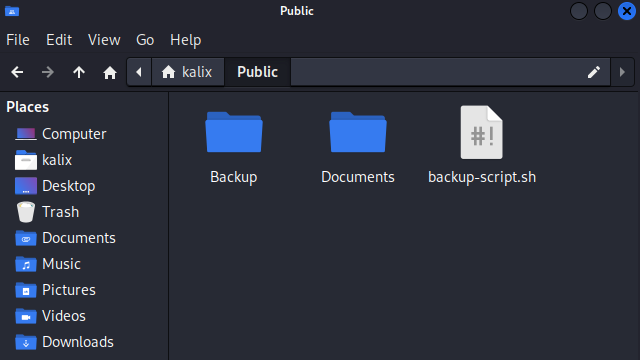

source image: pexel.com

When doing computer work, clicking “save” is necessary to either literally or not literally save your job. This content is helpful when you are working on the Linux Operating System (OS), especially running a server. Automatically backing up your server can cost you money on a monthly basis and, of course, can save your business.

Just imagine how much of your time and effort goes to waste when you forget or have the tardiness to just press `ctrl + s` on your office application. Without further ado, let’s get started.

## Prerequisite

Things you need before you proceed:

-   Computer running Linux Operating System
-   SSH to access Linux OS Server (situational)
-   Free storage enough to save your work
-   nano, vim, or your favorite text editor
-   Cronjob `crontab -e`

This is a `bash` script dependencies are to follow:

-   tar
-   tee
-   head
-   xargs
-   gzip

If some bash commands are not natively installed, just i.e. `sudo apt install gzip` in the terminal.

## How Back-up Script works?

This automation is using a `crontab`. Let’s say you have two folders in the tree (for simplicity).



– OR –

Visually..

-   Backup -The folder where all your backups go
-   Documents – The folder where all your important files are saved i.e. web files, office files.
-   backup-script.sh – an executable bash file

Basically, this script creates an archive file (named filename.tar.gz) of `Documents` folder and automatically saves it to `Backup` folder.

## The Bash Code

In your terminal command, just copy and paste the single command line below:

Go to your parent folder like `Public` and create a file using your favorite editor.

```
nano backup-script.sh
```

Copy and Paste below:

```bash
#!/bin/bash
##
# ./backup-files SOURCE DESTINATION
# (2) PARAMETERS required, destination where to save
# backup files and target files to backup
# .log File is in destination folder
#
# Pre-requisite: tar, tee, head, xargs, gzip
#
# Make it executable
# chmod u+x ./backup-files.sh
#
##
START=$(date +%s)
LOGS=$(date '+%m-%d-%Y %H:%M:%S')
if [ -z "$1" ] || [ -z "$2" ]; then
    LOGS+=" - ERROR: (2) PARAMS required"
        echo $LOGS
        echo "usage:"
        echo "./backup-files.sh SOURCE_FOLDER DESTINATION_FOLDER"
        echo "SOURCE_FOLDER - file source to be added in the archive"
        echo "DESTINATION_FOLDER - file destination to where the archive.tar.gz is saved"
        echo "e.g."
        echo "./backup-files.sh /home/username/public_hmtl /home/username/backup"
        exit 255;
fi

#PARAMS
DEBUG=false #Bolean
KEEP_FILES=5 #Only keep 5 recent files; 0 to disable
SOURCE_FOLDER=$1 # SOURCE_FOLDER="backup-source backup-another-source" #the folder that contains the files that we want to backup
BACKUP_FOLDER=$2
CWD=$(pwd) # assigning Current Working Directory (CWD)
#Database Exports
# Note: No whitespace in the -p Flag
# Warining: Careful of hard coded credentials
#mysqldump -u username -p'SecurePassword' DatabaseName | gzip > /home/username/www/public/backup/DatabaseName_`date +\%m-\%d-\%Y_\%H:\%M`.sql.gz

# Preinstalls --> For testing purpose only; delete this
if [[ "${DEBUG}" == "true" ]]; then
    echo "---START Preinstall----"
    mkdir -p $SOURCE_FOLDER && cd $SOURCE_FOLDER #
    SOURCE_FOLDER=$(pwd) # Re-assigning to absolute path
    mkdir -p new-folder
    echo "This is file 1" | tee -a ./file1.txt >/dev/null 2>&1
    echo "<h2>This is file 2</h2>" | tee -a ./file2.html >/dev/null 2>&1
    echo "<h3>This is file 3</h3>" | tee -a ./new-folder/file3.htm >/dev/null 2>&1
    pwd && ls
    echo -e "---END Preinstall---- \r\n"
fi
## End of preinstall --> delete until here.

# Check if Source Folder is not empty
if [ ! -d $SOURCE_FOLDER ] || [ -z "$(ls -A $SOURCE_FOLDER)" ]; then
    echo "error: SOURCE FOLDER is empty"
    exit 255;
fi

# The following is path correction for supposedly accuracy
cd $SOURCE_FOLDER && SOURCE_FOLDER=$(pwd) # Re-assigning to absolute path
cd $CWD && mkdir -p $BACKUP_FOLDER # Create backup folder if not available
cd $BACKUP_FOLDER && BACKUP_FOLDER=$(pwd) # Re-assigning to absolute path

FOLDERNAME="" # we don't know yet
TRIMPATH="[^\/]+$" # capture the backup folder name only
# Trim function
if [[ $BACKUP_FOLDER =~ $TRIMPATH ]]; then FOLDERNAME=${BASH_REMATCH[0]}
fi

BACKUPDATE=`date +%b-%d-%Y` #get the current date #replace this path
BACKUP_FILE=$BACKUP_FOLDER/backup-$BACKUPDATE.tar.gz

# Remove older backups first
# Check if file if exists
if [ $KEEP_FILES != 0 ] && [ -d $BACKUP_FOLDER ] && [ -n "$(ls -A $BACKUP_FOLDER)" ]; then
    # Only keep 5 recent backup files
    LOGS+="$(ls -tr $BACKUP_FOLDER/backup-*.tar.gz | head -n -$KEEP_FILES | xargs --no-run-if-empty rm)"
fi

# Avoid duplicate backup if exist
[ -f "$BACKUP_FILE" ] && rm $BACKUP_FILE

cd $SOURCE_FOLDER # Change Directory to avoid "tar: Removing leading `/' from member names" error
LOGS+="- Backup is running.. "
if [[ "${DEBUG}" == "true" ]]; then
    LOGS+="$(tar --exclude=*/$FOLDERNAME -zvcf $BACKUP_FILE .)" #create the backup, just add -v flag for verbose
else
    LOGS+="$(tar --exclude=*/$FOLDERNAME -zcf $BACKUP_FILE .)" # non-verbose
fi

END=$(date +%s)
DIFF=$(( $END - $START ))
LOGS+="It took $DIFF second to backups."

# Printing logs
echo -e $LOGS | tee -a $BACKUP_FOLDER/backup0.log >/dev/null 2>&1
echo $LOGS

# Debug results
if [[ "${DEBUG}" == "true" ]]; then
    echo "---Start Debug Extract---"
    cd $BACKUP_FOLDER && pwd && ls -lah
    tar -xvf backup-$BACKUPDATE.tar.gz >/dev/null 2>&1
    echo -e "\r-- Files from Extracted from backup-$BACKUPDATE.tar.gz --"
    pwd && ls -lah
    echo -e "\r-- Log File --"
    cat backup0.log
    echo "---End Debug Extract---"
fi
exit 0
```

Note: To test the code above, just run this code on [jdoodle.com](https://www.jdoodle.com/test-bash-shell-script-online/) but set DEBUG=true

> Command Line Arguments:
> 
> home/username/backup /home/username/public_hmtl
> 
> Important: DEBUG=true

This could be boring, but this is an awesome script (quote and quote) 😀

## Executing the Backup Script

Make the file executable by a current user (your self) running terminal command below:
```sh
chmod u+x ./backup-script.sh
```

### Automation

Make the backup script executable for the current user (as yourself) by running the terminal command below:

```sh
crontab -e
```

Choose your favorite code editor, I suggest choosing `nano` editor for simplicity.

Add the cron job code at the very last line.

```sh
0 1 * * 0 ~/public/backup-script.sh ~/public/Documents ~/public/Backup >> ~/public/cron.all.log 2>&1
```

This will run every “At 01:00 on Sunday.” To play around with the cron scheduler, try and test with [crontab.guru](https://crontab.guru/) is highly recommended.

`0 1 * * 0` – weekly basis

`0 8 * * *` – daily basis at 08:00am

### Manually (Situational)

You can also manually use this script by running..

```sh
./backup-script.sh ~/public/Documents ~/public/Backup
```

## Recommendations

Generating database backup files must come first before invoking this backup script. In the next topic, let’s talk about “How to automatically backup your SQL database”.

## Disclaimer

This script is well tested in the production environment or real-world scenario and carefully written to prevent any unnecessary bugs or outcomes. However, I am not liable for any issues that this script may cause you. But feel free to drop your comments below if you have questions, suggestions, or recommendations. I would appreciate it. Thank you!